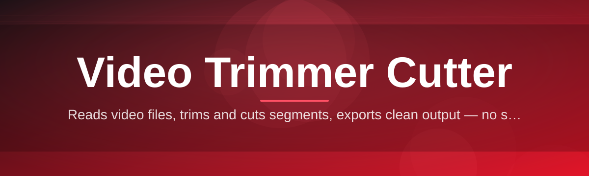

# video-trimmer-editor ✂️🎬

  

*Trim the fat, keep the footage — a lightweight Windows video trimmer and cutter built for speed, not spectacle.*

  

---

## 🎯 Overview

**video-trimmer-editor** is a focused desktop tool for one job: getting the exact clip you need out of a longer video, fast. No timeline soup, no plugin marketplace, no rendering farm required — just drag in a file, mark your in/out points, and export. It's the video trimmer and cutter equivalent of a good pair of scissors: unglamorous, but you reach for it constantly.

This project exists because most video editors solve problems you don't have. You don't need color grading to cut a 40-minute stream down to a 30-second highlight. You don't need a multi-track compositor to remove dead air from a screen recording. **video-trimmer-editor** strips video editing down to trimming, cutting, and exporting — the 90% of tasks that 90% of people actually do.

It's built for **streamers clipping highlights**, **educators trimming lecture recordings**, **developers cutting bug-report footage**, and anyone who has ever opened a bloated editor just to shave ten seconds off a clip and given up out of frustration. If that's you, welcome home.

---

## 📊 Before / After

| | Before video-trimmer-editor | After video-trimmer-editor |
|---|---|---|
| **Time to first cut** | 5–10 minutes (project setup, importing, timeline dragging) | Under 30 seconds |
| **Learning curve** | Tutorials required | Zero — drag, mark, export |
| **File size on disk** | 500MB+ editor install | Single standalone executable |
| **Export wait** | Full re-render, minutes | Near-instant stream copy when possible |
| **CPU load** | Editing suite idles hot | Sits quiet until you hit Export |
| **Mental overhead** | "Which tool do I even need?" | "Trim. Cut. Done." |

> [!NOTE]
> This table reflects typical workflows for short trim-and-export tasks — not full production editing. If you need multi-track compositing, this isn't that tool, and that's on purpose.

---

## 🚀 What It Actually Does

1. **Frame-accurate trimming** — drag handles on the timeline or nudge frame-by-frame with arrow keys, so your cut starts exactly where you want it, not "close enough."

2. **Lossless cutting mode** — when your cut points align with keyframes, the video trimmer cutter copies the stream directly instead of re-encoding, preserving original quality and finishing in seconds.

3. **Multi-segment export** — mark several in/out ranges in one pass and export them as separate clips or stitch them into a single output.

4. **Live scrub preview** — a responsive preview window updates instantly as you drag the playhead, no buffering spinner, no lag between action and feedback.

5. **Format-flexible input** — MP4, MOV, MKV, AVI, and WEBM sources are accepted without conversion gymnastics beforehand.

6. **Silent-section detection** — an optional pass scans audio levels and suggests trim points around dead air, useful for tightening podcasts and screen recordings.

7. **Batch queue** — line up multiple source files with their own trim ranges and let the app work through the queue unattended.

8. **Thumbnail filmstrip** — the timeline renders a strip of frame thumbnails so you can visually spot the moment you're looking for instead of guessing timestamps.

9. **Undo-safe editing** — every trim, cut, and reorder action sits on an undo stack, so experimentation costs nothing.

10. **Portable operation** — runs from a single folder with no system-wide install, ideal for USB drives or locked-down machines.

---

## 🏁 Getting Started

1. **Visit the landing page** using the download button above or below.

2. **Download** the current 2026 build for Windows.

3. **Run the executable** — no installer wizard, no admin prompt required for the standard portable mode.

4. **Drop in a video file**, set your in/out markers, and hit Export.

> [!TIP]
> Keep the app's folder on a fast drive (SSD, not network storage) for the smoothest scrubbing experience on large 4K files.

---

## 🖥️ System Requirements

| Component | Minimum |
|---|---|
| **OS** | Windows 10 or Windows 11 (64-bit) |
| **RAM** | 4 GB (8 GB recommended for 4K sources) |
| **Disk** | 200 MB free for the app itself |
| **Dependencies** | None — fully standalone |
| **GPU** | Optional, used for preview acceleration if available |

> [!IMPORTANT]
> No runtime, framework, or codec pack needs to be installed separately. The video trimmer cutter ships with everything it needs bundled in.

---

## ⚙️ How It Works

The internal flow is intentionally simple — a straight pipeline instead of a tangled editing graph:

1. **Load** — the source file is probed for streams, duration, and keyframe positions.
2. **Mark** — you set in/out points on the timeline; the app maps these to the nearest usable frame.
3. **Decide** — the engine checks whether the cut can be a stream copy (fast, lossless) or needs re-encoding (slower, format-flexible).
4. **Process** — the chosen path executes, writing output frame-accurately.
5. **Export** — the finished clip is written to your chosen destination folder.

---

## 🧩 Troubleshooting

**Q: My export took much longer than expected — why?**
A: If your trim points don't land on keyframes, the tool falls back to re-encoding that segment instead of a stream copy. Snapping markers to keyframe hints in the timeline avoids this.

**Q: The preview stutters on large 4K files.**
A: Enable GPU-accelerated preview in Settings, or work from a proxy-resolution preview if your source is high bitrate.

**Q: My exported clip has no audio.**
A: Check that the source file's audio track wasn't muted or excluded during import — some MKV containers store multiple audio streams, and the wrong one may be selected by default.

**Q: Can I recover a project after closing the app?**
A: Trim sessions autosave to a temporary project file; reopening the same source file prompts you to restore the last session.

**Q: Why does my MOV file look shifted by a frame after cutting?**
A: Some MOV variable-frame-rate encodes report imprecise timestamps. Switch to re-encode mode for frame-exact results on VFR sources.

**Q: The app won't launch on a locked-down office PC.**
A: Run it from a folder you have write access to — it needs to write temporary cache and thumbnail files nearby.

---

## 🎨 UI & UX Details

<strong>Keyboard shortcuts</strong>

| Action | Shortcut |
|---|---|
| Play / Pause | `Space` |
| Set In Point | `I` |
| Set Out Point | `O` |
| Nudge frame back / forward | `←` / `→` |
| Split at playhead | `S` |
| Undo / Redo | `Ctrl+Z` / `Ctrl+Y` |
| Export | `Ctrl+E` |
| Zoom timeline | `+` / `-` |

<strong>Themes and settings</strong>

- Light and Dark interface themes, switchable without restart

- Adjustable timeline zoom sensitivity

- Configurable default export folder

- Toggle for keyframe-snap assist

- Optional silent-section auto-suggestion overlay

> [!TIP]
> Dark theme is the default for late-night clip sessions, but Light theme has better contrast for filmstrip thumbnails on dim displays.

---

## 🤝 Contributing & Community

This project welcomes contributors of every experience level — genuinely, not as a slogan.

- Browse issues tagged **good first issue** for approachable starting points.

- Bug reports with a sample clip and reproduction steps are gold.

- Feature discussions happen in Issues before pull requests, so design gets talked through first.

- Documentation fixes, translation help, and UI polish are just as valued as core engine work.

> [!NOTE]
> New to open source? This repo is a friendly place to make your first pull request. Small, focused changes are preferred over massive rewrites.

 

---

## 📄 License

Released under the [MIT License](LICENSE), 2026.

---

## ⚠️ Disclaimer

> [!WARNING]
> This tool is provided as-is, for personal and educational video trimming and cutting tasks. Always keep backups of original source footage before performing destructive exports. The maintainers are not responsible for data loss resulting from misuse or unexpected file corruption.

---

